  <!-- Main Animated Hero Banner -->
  

 

<!-- Tech Stack Section -->
<h2 align="center">💻 Tech Stack</h2>

  
  
  
  
  
  
  
  
  
  

 

<!-- GitHub Stats Section -->
<h2 align="center">📊 GitHub Metrics</h2>

  
    
  
    
  

 

<!-- Random Quote Section -->

  

 

---

  

